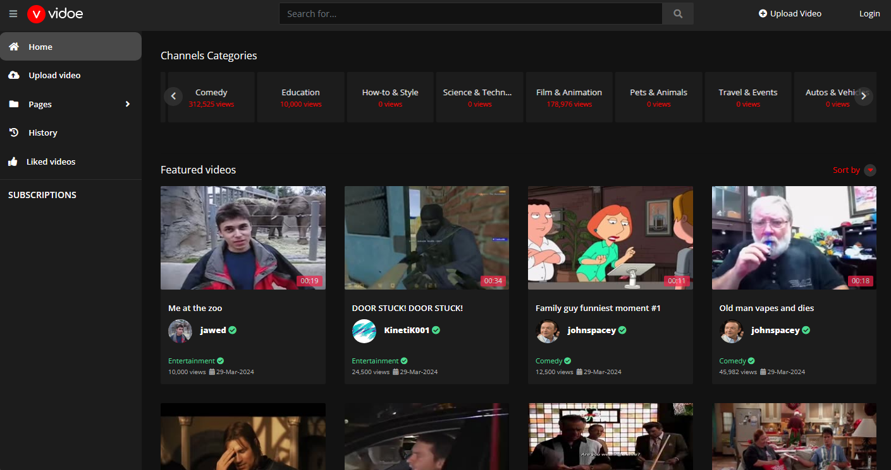
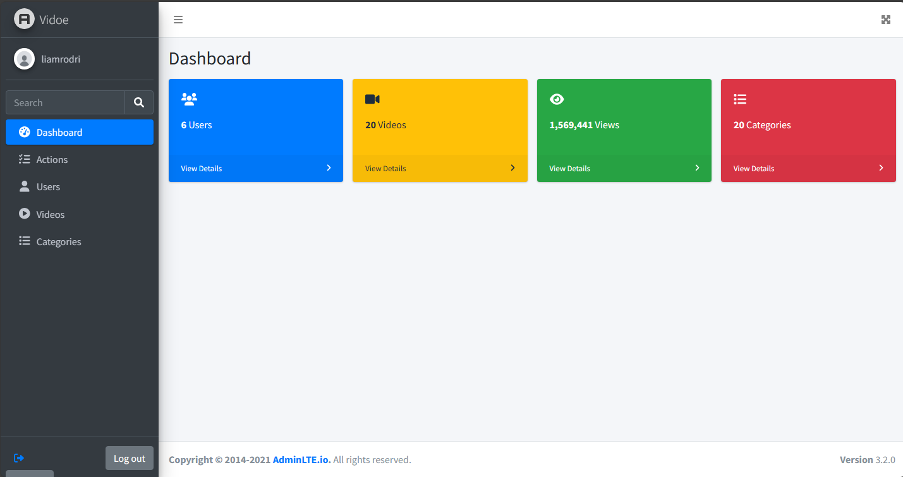
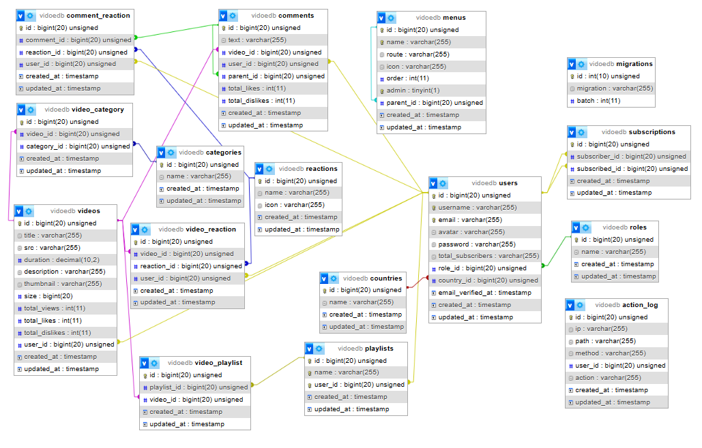

# Vidoe
## ❓ Description
This website represents a online video sharing platform.

Laravel version: 10.45.1

PHP version: 8.2.12

## Front End



## Admin panel



## Database design



## 🌟 Features
These are some of the functionalities that users are provided with

Videos

* Upload a video
* Delete a video
* Edit a video
* React to a video

Comments

* Post a comment
* React to a comment
* Reply to a comment

Subscriptions

* Subscribe to another user's channel
* Unsubscribe from user's channel


Admins can manage the platform from the admin panel.

## 🛠️ Installation

### Requirements

- [Git](https://git-scm.com/)
- [Composer](https://getcomposer.org/)
- [PHP](https://www.php.net/)
- [FFMPEG](https://ffmpeg.org/)
- [PHP-FFMPEG](https://github.com/PHP-FFMpeg/PHP-FFMpeg)
- [XAMPP](https://www.apachefriends.org/)

### Installation steps

1. Clone the repository (or download the zip file)
```bash
   git clone https://github.com/svetozarzvkvc/Vidoe.git
```
2. Navigate into the project folder, open terminal and write this commands

2.1. Before getting starting open AppServiceProvider.php (app/Providers) and comment next lines: 36,37,43,44.
Uncomment those lines after step 2.9.

2.2. Install needed dependencies (this will create vendor folder in your project and dependencies will be stored there)
```bash
composer install
```
2.3. Install ffmpeg<br/>

Install ffmpeg by following the instructions from their website and after installation copy ffmpeg folder to vendor folder inside the project.

2.4. Create env file
```bash
cp .env.example .env
```

2.5. Edit env file<br/>

Open env file and edit database parameters as desired.

2.6. Generete application key
```bash
php artisan key:generate
 ```

2.7. Run migration to create database tables (you will need xampp with mysql option on to be able to run this step, same goes for seeding in step 2.8.)
```bash
 php artisan migrate
```
2.8. Run seeders to fill database tables with data
```bash
 php artisan db:seed
```

2.9. Start local server
```bash
 php artisan serve
```

2.10. Configure SMTP parameters

If you want to send verification emails to users when they register and receive emails sent by users via the contact page you need to make some changes.

First you need to update env file and add your SMTP parameters (lines 31-38).

In ContactController.php (app/Https/Controllers) you need to change `youremail@test.com` to a desired email to witch you would like to receive emails at (line 27).

## 🔐 User credentials
Email: 
```bash 
jawed@test.com
```
Password: 
```bash
user
```
## 🔐 Admin credentials
Email: 
```bash 
liamrodri@test.com
```
Password: 
```bash
admin
```
## 📄 Documentation
You can find out all the details from the documentation file:

<a href="https://github.com/svetozarzvkvc/Vidoe/blob/main/public/assets/docs/documentation-en.pdf">Documentation</a>

## If you like this project please leave a star ❤
